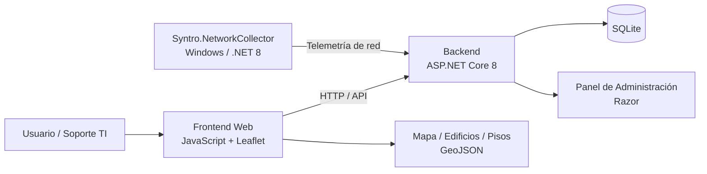

# SYNTRO — Capstone Grupo 2

SYNTRO es una solución desarrollada como proyecto Capstone de la carrera de **Ingeniería en Informática de Duoc UC, Sede San Joaquín**.

El proyecto busca apoyar la **localización, visualización y gestión de activos tecnológicos dentro de entornos hospitalarios**, utilizando un mapa interactivo que relaciona edificios, pisos, ubicaciones e inventario de equipos con información obtenida desde procesos de escaneo de red.

La solución está orientada principalmente a equipos de **Soporte TI y administración técnica**, especialmente en organizaciones de gran extensión física donde localizar rápidamente un equipo, edificio o dependencia puede resultar complejo.

## Problema que resuelve

En instalaciones hospitalarias de gran tamaño, los equipos de soporte pueden enfrentar dificultades para:

- identificar dónde se encuentra físicamente un equipo;
- localizar edificios y pisos dentro del recinto;
- relacionar el inventario registrado con los equipos detectados en la red;
- identificar cambios o discrepancias en la ubicación de los activos;
- disponer de una visualización centralizada del estado y ubicación de los equipos.

SYNTRO busca centralizar esta información y representarla sobre un **mapa interactivo**, facilitando la búsqueda y localización de activos tecnológicos.

> **Alcance actual del MVP:** computadores (PC). La arquitectura contempla su extensión a otros tipos de activos, como impresoras.

---

## Integrantes

| Integrante | Rol principal en el proyecto |
|---|---|
| **Antonia Pacheco** | Análisis, documentación, requisitos no funcionales y apoyo en diseño funcional |
| **Constanza Gaete** | Requisitos funcionales, experiencia de usuario, mockups y presentación del producto |
| **Paolo Vilches** | Desarrollo de software, arquitectura técnica, modelo de datos e integración |

---

## Información académica

- **Asignatura:** Capstone
- **Código de asignatura:** PTY4614
- **Sección:** 006
- **Jornada:** Vespertina
- **Profesor guía:** Alex Zúñiga Montiel
- **Institución:** Duoc UC
- **Sede:** San Joaquín
- **Periodo académico:** 2026

---

## Tecnologías utilizadas

### Frontend

- JavaScript vanilla
- Leaflet
- Leaflet.draw
- Webpack
- HTML / CSS

### Backend

- .NET 8
- ASP.NET Core 8
- Entity Framework Core
- Razor Pages / panel de administración

### Persistencia

- SQLite

### Infraestructura y ejecución

- Docker
- Docker Compose
- Nginx
- Arquitectura **on-premise**

### Recolección de información de red

- .NET 8
- Aplicación `Syntro.NetworkCollector`
- Ejecución en Windows

### Pruebas

- xUnit
- SQLite en memoria
- Jest

> La solución no depende actualmente de servicios cloud para su funcionamiento. El despliegue previsto para el MVP es **local/on-premise**.

---

## Arquitectura de la solución

SYNTRO se organiza en tres componentes principales:

1. **Frontend web:** muestra el mapa interactivo, edificios, pisos, inventario y telemetría utilizando Leaflet.
2. **Backend / API:** administra usuarios, inventario, ubicaciones, edificios, configuración y persistencia de información.
3. **Recolector de red:** componente ejecutado en Windows que analiza la red, obtiene información de los equipos y envía los resultados a la API.



### Flujo simplificado

```text
Red del hospital
      │
      ▼
Syntro.NetworkCollector
      │
      ▼
ASP.NET Core API
      │
      ├── SQLite
      │
      └── Panel de administración
      │
      ▼
Frontend + Leaflet
      │
      ▼
Mapa interactivo de SYNTRO
```

---

## Metodología de trabajo

El proyecto utiliza una metodología **Tradicional / Cascada (SDLC)**.

El desarrollo se organiza de forma secuencial en las siguientes etapas:

1. **Levantamiento y análisis de requisitos**
2. **Diseño funcional y técnico**
3. **Implementación**
4. **Pruebas y validación**
5. **Despliegue y documentación**

Los documentos generados durante cada etapa se utilizan como evidencia y línea base para la etapa siguiente.

---

## Ejecución local

La forma recomendada de ejecutar SYNTRO localmente es mediante **Docker y Docker Compose**.

### Requisitos previos

- Git
- Docker
- Docker Compose

### 1. Clonar el repositorio

```bash
git clone https://github.com/zomni/Syntro.git
cd Syntro
```

### 2. Configurar variables de entorno

Crear el archivo `.env` tomando como referencia:

```text
backend/.env.example
```

Es necesario definir, entre otras variables, las credenciales del administrador inicial:

```env
ADMIN_EMAIL=correo@ejemplo.cl
ADMIN_PASSWORD=contraseña_segura
```

### 3. Construir e iniciar los servicios

```bash
docker compose up -d --build
```

### 4. Acceder a la aplicación

Una vez iniciados los contenedores:

- **Mapa / Frontend:** `http://localhost:8081`
- **API:** `http://localhost:5001`
- **Panel de administración:** `http://localhost:5001/dashboard`

### Ejecución para desarrollo

#### Backend

```bash
dotnet run --project backend/Syntro.API
```

#### Pruebas del backend

```bash
dotnet test backend/Syntro.sln
```

#### Frontend

```bash
cd frontend
npm ci
npm run build
```

#### Pruebas del frontend

```bash
npm test
```

---

## Estructura principal del proyecto

```text
Syntro/
├── backend/
│   └── Syntro.API/              # API y panel de administración
├── frontend/                    # Mapa web
├── tools/
│   └── Syntro.NetworkCollector/ # Recolector de telemetría de red
├── spec/                        # Especificaciones técnicas
├── docs/                        # Documentación de arquitectura
└── docker-compose.yml           # Stack de ejecución local
```

---

## Contenido documental del Capstone

La documentación y evidencias académicas del proyecto se organizan por las distintas fases de trabajo del Capstone:

- **Fase 1**
- **Fase 2**
- **Fase 3**

Estas evidencias incluyen planificación, requisitos, diseño, arquitectura, pruebas, documentación técnica y material asociado a la presentación y evaluación del proyecto.

---

## Estado del proyecto

SYNTRO se encuentra actualmente en desarrollo como **MVP para contexto hospitalario**.

Las funcionalidades y alcances descritos en este README pueden evolucionar durante las siguientes fases del proyecto Capstone.
